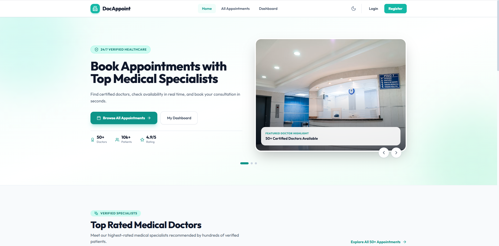

# 🩺 Doctor Appointment Manager (DocAppoint)

DocAppoint is a full-stack Doctor Appointment Booking System that enables patients to browse doctors, book appointments, and manage their bookings through a secure and user-friendly interface. Built with modern web technologies, it delivers a fast, responsive, and seamless healthcare experience.

---

## 🌐 Live Demo

- **Client:** https://doc-appoint-client-nu.vercel.app
- **Server API:** https://docappoint-server-mvur.onrender.com

---

## 📸 Screenshot



---

## 🎯 Project Overview

DocAppoint simplifies the appointment booking process by allowing users to search doctors, filter specialists, securely authenticate, and manage appointments through a personalized dashboard. The application follows a modern client-server architecture with JWT-based authentication and MongoDB as the database.

---

## ✨ Key Features

- 🩺 Browse doctors by specialty, ratings, experience, and consultation fees.
- 🔍 Search doctors by name, specialty, or hospital.
- 📊 Sort doctors by consultation fee and rating.
- 🔐 Secure JWT Authentication with Email/Password.
- 🔑 Google & GitHub Social Login.
- 📅 Private dashboard for managing appointments.
- ✏️ Update appointments using controlled forms.
- ❌ Cancel appointments instantly.
- 🌙 Dark & Light Mode.
- 📱 Fully responsive design for desktop, tablet, and mobile.
- ⚡ Fast loading experience with custom animations.

---

## 🛠️ Tech Stack

<p align="center">

</p>

### Frontend

- Next.js 14 (App Router)
- React 18
- Tailwind CSS
- Lucide React
- React Hot Toast

### Backend

- Node.js
- Express.js
- MongoDB Atlas
- Mongoose
- JWT Authentication
- BcryptJS

### Deployment

- Vercel (Client)
- Render (Server)

---

## 📦 Main Dependencies

### Client

- Next.js
- React
- Tailwind CSS
- Lucide React
- React Hot Toast
- Axios

### Server

- Express.js
- MongoDB
- Mongoose
- JWT
- BcryptJS
- Cors
- Dotenv

---

## 🚀 Getting Started

### Clone Repository

```bash
git clone https://github.com/asmaraf/DocAppoint.git
```

### Install Client Dependencies

```bash
cd client
npm install
```

### Install Server Dependencies

```bash
cd ../server
npm install
```

---

## ⚙️ Environment Variables

### Client (.env.local)

```env
NEXT_PUBLIC_API_URL=http://localhost:5000
```

### Server (.env)

```env
PORT=5000

MONGODB_URI=your_mongodb_connection_string

JWT_SECRET=your_jwt_secret

CLIENT_URL=http://localhost:3000
```

---

## ▶️ Run Locally

### Start Backend

```bash
cd server
npm run dev
```

### Start Frontend

```bash
cd client
npm run dev
```

Visit

```
http://localhost:3000
```

---

## 📂 Project Structure

```
DocAppoint
│
├── client
│
├── server
│
├── assets
│
└── README.md
```

---

## 🌍 Links

- 🌐 Live Website: https://doc-appoint-client-nu.vercel.app
- ⚙️ Server API: https://docappoint-server-mvur.onrender.com
- 💻 GitHub Repository: https://github.com/asmaraf/DocAppoint

---

## 👨‍💻 Author

**ASM Araf**

GitHub: https://github.com/asmaraf

---

## ⭐ Support

If you found this project helpful, consider giving it a ⭐ on GitHub.
